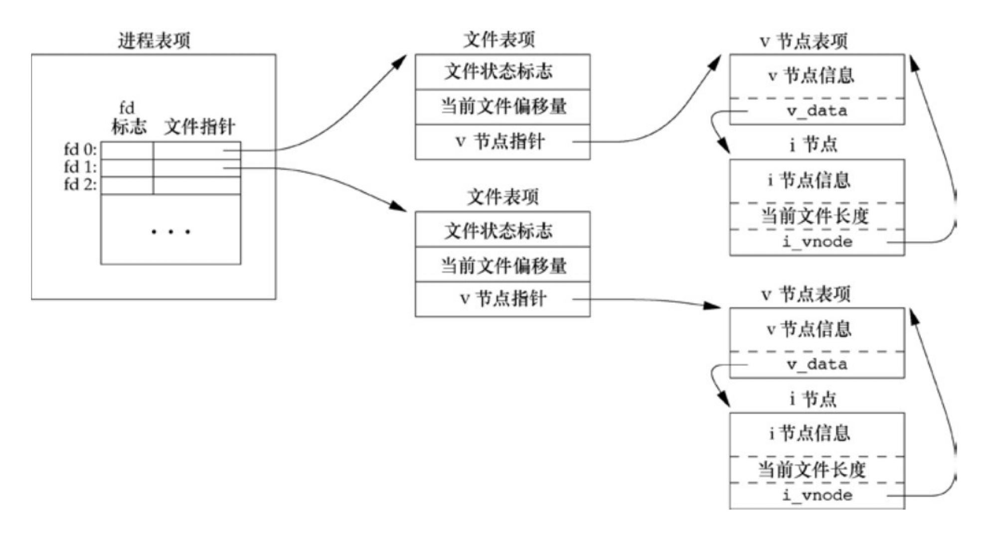

# 文件描述符

 定义在<unistd.h>

0	STDIN_FILENO

1	STDOUT_FILENO

2	STDERR_FILENO

范围是0--OPEN_MAX-1

# open(),openat()

```c
“#include <fcntl.h>
int open(const char *path, int oflag,... /* mode_t mode */);
int openat(int f d, const char *path, int oflag, ... /* mode_t mode */ );”
//成功则返回文件描述符,失败返回-1,
```

# creat()

```c
#include <fcntl.h>
int creat(const char *path, mode_t mode);
//返回值：若成功，返回为只写打开的文件描述符；若出错，返回−1
//注意，此函数等效于：
open(path, O_WRONLY｜O_CREAT｜O_TRUNC, mode);

```

在早期的UNIX系统版本中，open的第二个参数只能是0、1或2。无法打开一个尚未存在的文件，因此需要另一个系统调用creat以创建新文件。

现在，open函数提供了选项O_CREAT和O_TRUNC，于是也就不再需要单独的creat函数

```c
//要创建一个临时文件，并要先写该文件，然后又读该文件
open(path, O_RDWR｜O_CREAT｜O_TRUNC, mode);
```

# close()

```c
#include <unistd.h>

int close (int fd)；

//返回值：若成功，返回0；若出错，返回−1

//关闭一个文件时还会释放该进程加在该文件上的所有记录锁。
//进程终止时内核自动关闭他打开的所有文件
```

# lseek()

```c
//每个打开文件都有一个与其相关联的“当前文件偏移量”（current file offset）
//可以调用lseek显式地为一个打开文件设置偏移量。

#include <unistd.h>

off_t lseek(int fd, off_t offset, int whence);

//返回值：若成功，返回新的文件偏移量；若出错，返回为−1
```

对参数offset的解释与参数whence的值有关。

•若whence是SEEK_SET 0 ，则将该文件的偏移量设置为距文件开始处offset个字节。

•若whence是SEEK_CUR 1，则将该文件的偏移量设置为其当前值加offset，offset可为正或负。

•若whence是SEEK_END  2，则将该文件的偏移量设置为文件长度加offset，offset可正可负。

```c
//若lseek成功执行，则返回新的文件偏移量，为此可以用下列方式确定打开文件的当前偏移量：

off_t currpos;

currpos = lseek(fd, 0, SEEK_CUR);
```

这种方法也可用来确定所涉及的文件是否可以设置偏移量。如果文件描述符指向的是一个管道、FIFO或网络套接字，则lseek返回−1，并将errno设置为ESPIPE。

**因为偏移量可能是负值，所以在比较 lseek 的返回值时应当谨慎，不要测试它是否小于0，而要测试它是否等于−1**

# read()

调用read函数从打开文件中读数据。

```c
#include <unistd.h>

ssize_t read(int fd, void *buf, size_t nbytes);
```

返回值：读到的字节数，若已到文件尾，返回0；若出错，返回−1

如read成功，则返回读到的字节数。如已到达文件的尾端，则返回0。

# write()

调用write函数向打开文件写数据。

```C
#include <unistd.h>

ssize_t write(int fd, const void *buf, size_t nbytes);
```

返回值：若成功，返回已写的字节数；若出错，返回−1


# 文件共享

“内核使用3种数据结构表示打开文件”

“内核使用3种数据结构表示打开文件，它们之间的关系决定了在文件共享方面一个进程对另一个进程可能产生的影响。
（1）每个进程在进程表中都有一个记录项，记录项中包含一张打开文件描述符表，可将其视为一个矢量，每个描述符占用一项。与每个文件描述符相关联的是：
a．文件描述符标志（close_on_exec，参见图3-7和3.14节）；
b．指向一个文件表项的指针。
（2）内核为所有打开文件维持一张文件表。每个文件表项包含：
a．文件状态标志（读、写、添写、同步和非阻塞等，关于这些标志的更多信息参见3.14节）；
b．当前文件偏移量；
c．指向该文件v节点表项的指针。
（3）每个打开文件（或设备）都有一个 v 节点（v-node）结构。v 节点包含了文件类型和对此文件进行各种操作函数的指针。对于大多数文件，v节点还包含了该文件的i节点（i-node，索引节点）。这些信息是在打开文件时从磁盘上读入内存的，所以，文件的所有相关信息都是随时可用的。例如，i 节点包含了文件的所有者、文件长度、指向文件实际数据块在磁盘上所在位置的指针等


